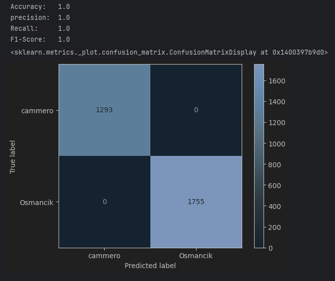
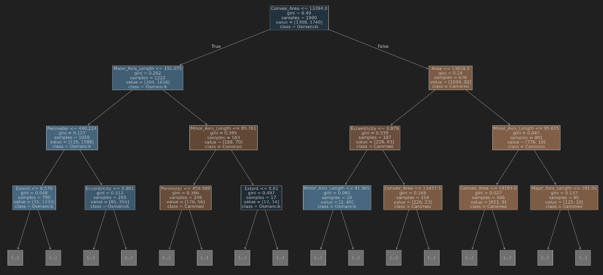
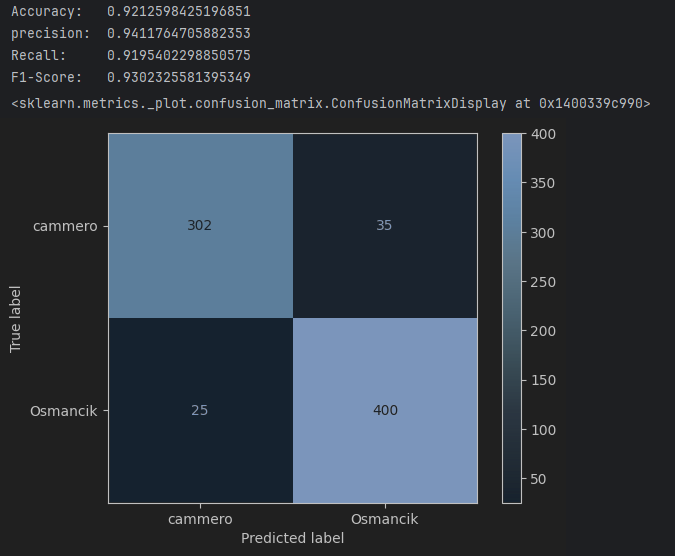

# 4th-Year-Machine-Learning-Random-Forest

## Rice Grain Clasification
This repository contains a [Jupyter](https://jupyter.org/) Notebook With the means to run a machine learning script to predict the type of a grain of rice

**Data**
the data was recieved from [UC Irvine Machine Learning Repository]([https://ourworldindata.org/life-expectancy](https://archive.ics.uci.edu/dataset/545/rice+cammeo+and+osmancik)), It contains data from pictures that where taken of rice grains in turkey and specifies which of the main two rice types within the country it is (Cammeo or Osmancik). The data set contains the following columns:
- **Area:** this column specifies how many pixels the rice grain took up in the picture (integer)
- **Perimeter:** this column contains the circumference of the rice grain in pixels (continuous) 
- **Major_Axis_Length:** this column contains the longest line that can be drawn on the rice grain (continuous)
- **Minor_Axis_Length:** this column contains the shortest line that can be drawn on the rice grain (continuous)
- **Eccentricity:** this column depicts how round the rice grain is (cotinuous)
- **Convex_Area:** this column contains the pixel area of the smallest convex shell of the rice grain (integer)
- **Extent:** this column contains the ratio of the rice grain to empty space within the image (continuous)
- **Class:** this column specifies wether the rice grain is Cammeo or Osmancik (Binary)

The data is taken in using pandas and stored in a variable

**Process**
1. the data is taken in from the file of type arff using [scipy](https://scipy.org/)

2. the class column is encoded to have the values of 0 and 1 for Cammeo or Osmancik

3. Then the training data is split from the test data

4. The decision trees are then created and fit to a random forest

5. The confusion matrix of the testing data is then shown with the Accuracy, Percision, Recall and F1-Score.
   
   The data looks over fit here but gives good results later on the test data.

6. The tree structure is then shown. below is a tree restricted to 4 nodes deep.
   

7. The remaining 20% of the data for the test is then used, the accuracy can be seen in the graph below:
   
   As you can see with the values in the above matrix, the accuracy is ~93% which is not bad for a machine learning prediction
